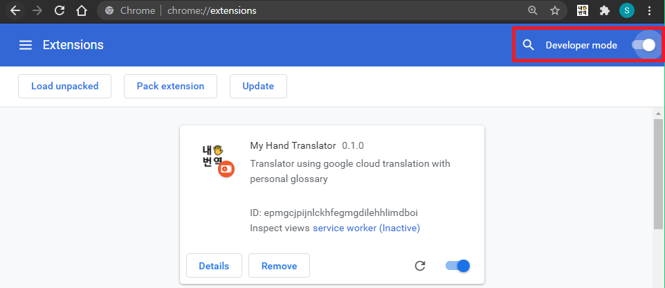
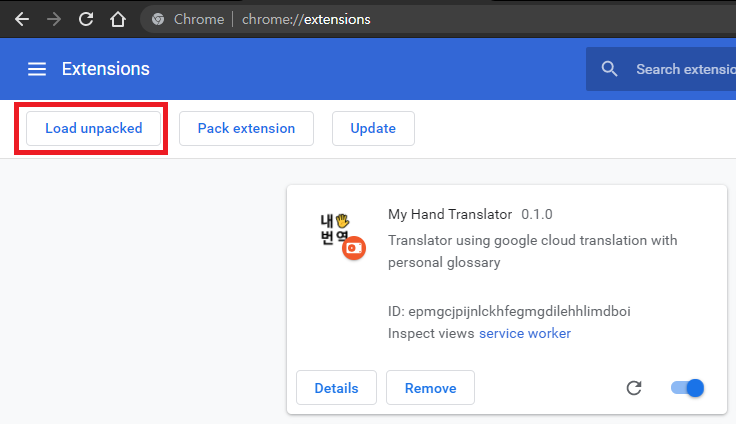
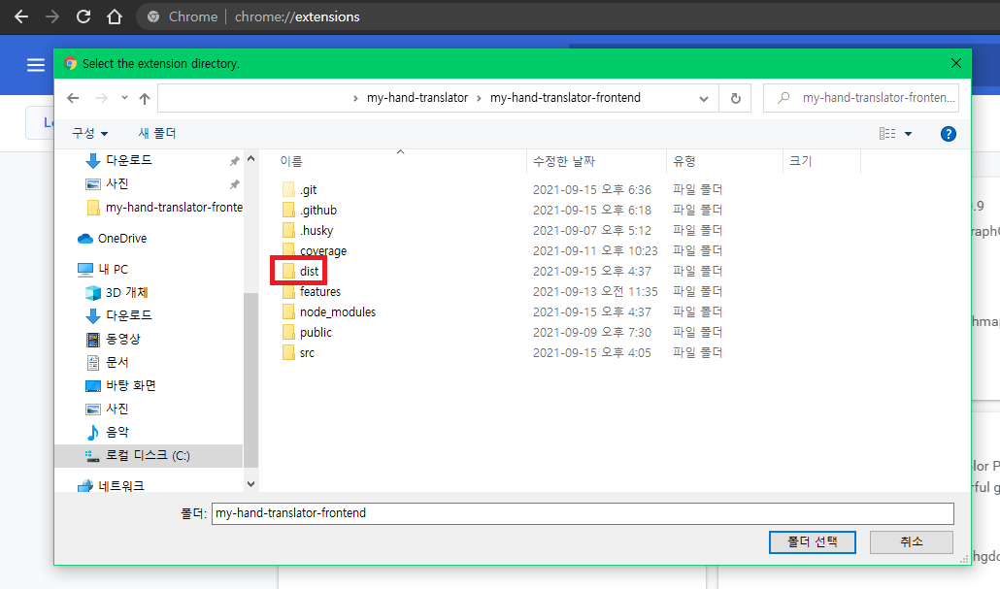
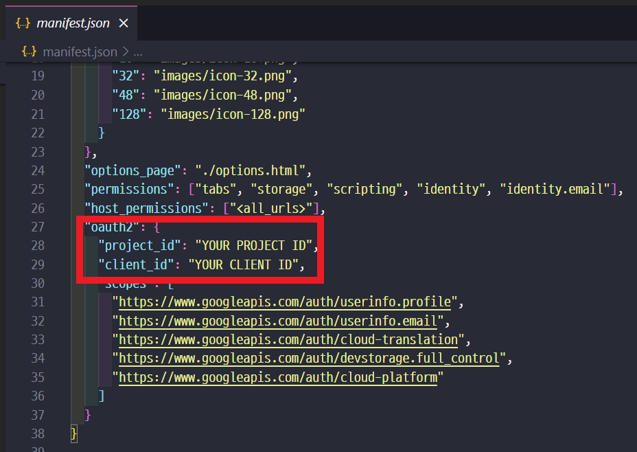

# 내손번역 My Hand Translator

[내손번역](https://my-hand-translator.github.io/)은 자신만의 용어집으로 텍스트 번역을 할 수 있는 크롬 확장 프로그램입니다. [Google Cloud Translation API](https://cloud.google.com/translate/)를 사용하여 월 50만 자를 무료로 번역할 수 있습니다. 확장 프로그램 내에서 번역, 용어집 생성 및 편집을 할 수 있습니다.

프로젝트에 기여하길 원하시나요? [기여하기](./CONTRIBUTING.md) 문서를 참고해주세요!

## 설치 및 다운로드

### 1. 크롬 스토어에서 다운로드*

[설치 링크](https://chrome.google.com/webstore/detail/my-hand-translator/iidfgdkckfjpabpfphlejemhoncclbdp)

> 현재 스토어에 올라와 있는 버전은 최신 버전이 아닙니다. 최신 버전을 다운 받으시려면 아래 직접 빌드하여 설치하기를 참고해주세요.


### 2. 직접 빌드하여 설치하기

다운로드를 위해, 아래 명령어를 터미널에 입력해주세요.

#### 2.1. 클론하여 빌드하기

```shell
git clone https://github.com/my-hand-translator/my-hand-translator-extension.git
```

```shell
cd my-hand-translator-extension
npm install
```

```shell
npm run build
```

`my-hand-translator-extension` 디렉토리에 소스코드가 빌드된 dist 폴더가 생성됩니다.

#### 2.2. 크롬 브라우저에서 확장 프로그램 로드

크롬 브라우저를 열고 `chrome://extensions/`에 접속합니다.



우측 상단에 개발자 모드를 켭니다.



좌측 상단에 `압축 해제된 확장 프로그램을 로드합니다` 버튼을 클릭합니다.



이전 과정에서 생성된 dist 폴더를 선택합니다. My Hand translator(내손번역) 확장 프로그램이 설치될 것입니다.



[GET STARTED](https://my-hand-translator.github.io/#/get-started) 페이지를 참고해 본인의 구글 클라우드 플랫폼 프로젝트 아이디와 OAuth2 키를 dist 폴더 안에 있는 `manifest.json` 파일에 입력합니다.

다시 `chrome://extensions/`에서 확장 프로그램을 새로고침 합니다.

이제 정상적으로 사용할 수 있습니다.

더 많은 정보는 [홈페이지](https://my-hand-translator.github.io)에서 확인해주세요.

## Contributors

[//]: contributor-faces

<a href="https://github.com/aidencoders"></a>
<a href="https://github.com/sounmind"></a>
<a href="https://github.com/jch1223"></a>

[//]: contributor-faces
